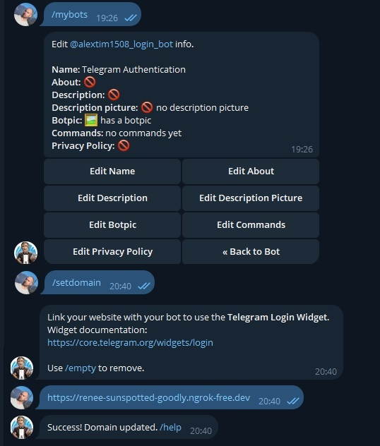
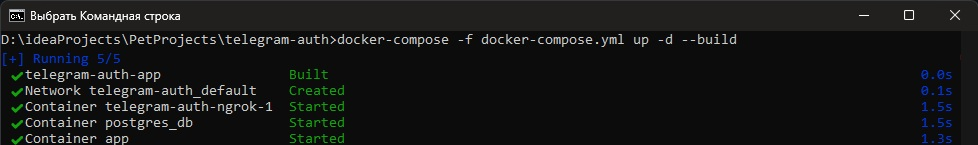
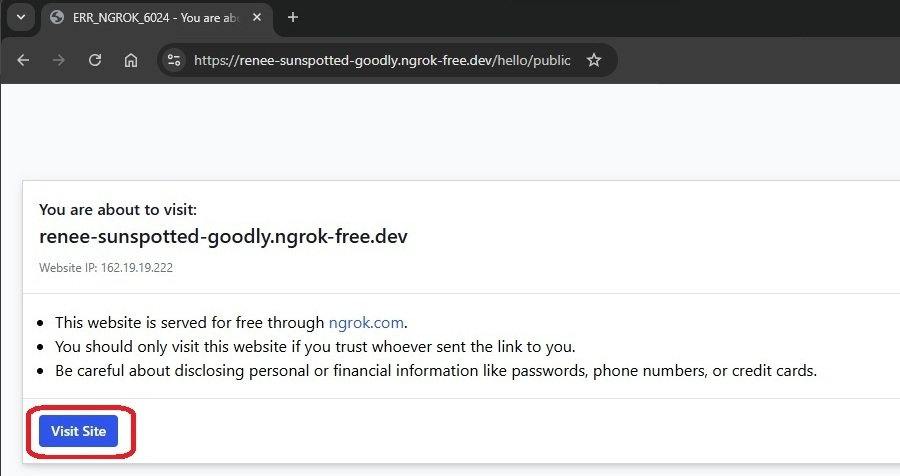
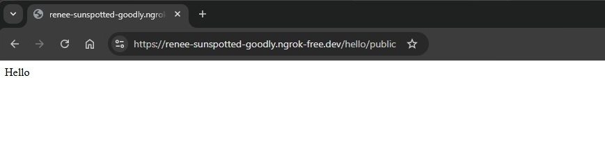
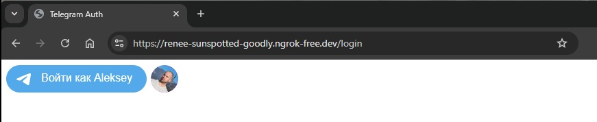
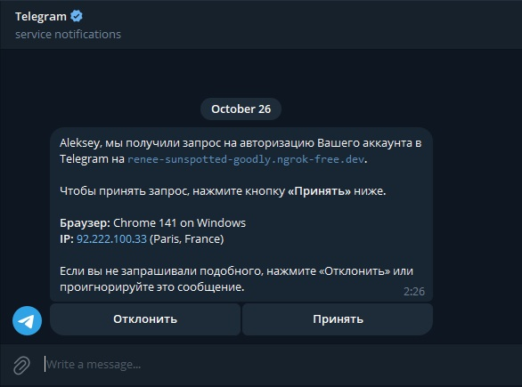
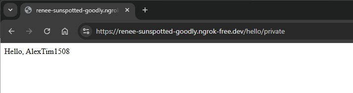

# Telegram Authentication Service

Пример интеграции аутентификации через Telegram Login Widget в Spring Boot приложении.

Для работы аутентификации требуется домен. Если у вас его нет, вы можете использовать ngrok. В данном примере будет использоваться именно он.

## ⚙️ Предварительная настройка

Перед запуском выполните следующие шаги:

### Настройка Ngrok:

1. Зарегистрируйтесь на [сайте ngrok](https://dashboard.ngrok.com/get-started/your-authtoken) и получите свой токен аутентификации (`YOUR_NGROK_AUTH_TOKEN`).
2. Получите субдомен в разделе [Domains](https://dashboard.ngrok.com/domains) (`YOUR_NGROK_SUBDOMAIN`). Он будет использоваться как `APP_BASE_URL`.

### Создание Telegram Bot:

1. Создайте бота через [BotFather](https://t.me/BotFather).
2. Получите `YOUR_TELEGRAM_BOT_TOKEN` и `YOUR_TELEGRAM_BOT_USERNAME`.
3. В настройках бота (Bot Settings -> Edit Domain) привяжите ваш домен (`APP_BASE_URL`).



## 🛠 Конфигурация проекта

### 1. Создайте файл конфигурации Ngrok `secrets/ngrok.yml`

Укажите ваш `YOUR_NGROK_AUTH_TOKEN`.

```yaml
version: "2"
authtoken: YOUR_NGROK_AUTH_TOKEN
tunnels:
  myapp:
    proto: http
    addr: 8080
```
### 2. Создайте файл переменных окружения `secrets/telegram-token.env`

Укажите полученные данные от BotFather.

```env
TELEGRAM_BOT_TOKEN=YOUR_TELEGRAM_BOT_TOKEN
TELEGRAM_BOT_NAME=YOUR_TELEGRAM_BOT_USERNAME
```

### 3. Установите базовый URL приложения в `docker-compose.yml`
Замените `YOUR_NGROK_SUBDOMAIN` на ваш субдомен ngrok.

```yaml
environment:
  APP_BASE_URL: https://YOUR_NGROK_SUBDOMAIN.ngrok-free.dev
```

## 🚀 Запуск приложения

## 1. Склонируйте репозиторий и перейдите в его директорию:

```bash
git clone https://github.com/alextim1508/telegram-auth
cd telegram-auth
```

## 2. Запустите сервисы с помощью Docker Compose (может потребоваться VPN):

```yaml
docker-compose -f docker-compose.yml up -d --build
```



## 3. Доступ к приложению:

Замените `YOUR_NGROK_SUBDOMAIN` на ваш субдомен ngrok.

---

Публичная страница: `https://YOUR_NGROK_SUBDOMAIN.ngrok-free.dev/hello/public`



Страница является стандартной предупреждающей страницей ngrok, которая отображается один раз первому посетителю

Нажмите "Visit Site"



Публичные данные корректно отображаются.

---

Приватная страница (требует аутентификации): `https://YOUR_NGROK_SUBDOMAIN.ngrok-free.dev/hello/private`

При попытке доступа будет выполнен редирект на форму Login ('/login'), где размещен Telegram Login Widget.



После нажатия кнопки входа через Telegram появится оповещение в чате с вашим ботом в приложении Telegram. Нажмите "Принять", 
чтобы подтвердить авторизацию.



После подтверждения аутентификации вы будете перенаправлены обратно на защищённый ресурс, и приватные данные корректно отобразятся.


